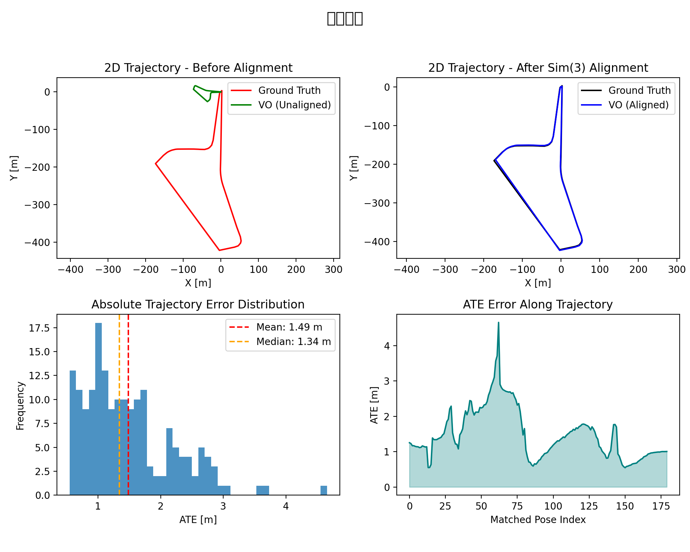

# PolyU-AAE5303-assignment-2:Visual Odometry with ORB-SLAM3


<div align="center">


**Monocular Visual Odometry Evaluation on UAV Aerial Imagery**

*Hong Kong Island GNSS Dataset - MARS-LVIG*

</div>

---

## 📋 Table of Contents

1. [Executive Summary](#-executive-summary)
2. [Introduction](#-introduction)
3. [Methodology](#-methodology)
4. [Dataset Description](#-dataset-description)
5. [Implementation Details](#-implementation-details)
6. [Results and Analysis](#-results-and-analysis)
7. [Visualizations](#-visualizations)
8. [Discussion](#-discussion)
9. [Conclusions](#-conclusions)
10. [References](#-references)
11. [Appendix](#-appendix)

---

## 📊 Executive Summary

This report presents the implementation and evaluation of **Monocular Visual Odometry (VO)** using the **ORB-SLAM3** framework on the **HKisland_GNSS03** UAV aerial imagery dataset. The project evaluates trajectory accuracy against RTK ground truth using **four parallel, monocular-appropriate metrics** computed with the `evo` toolkit.

### Key Results

| Metric | Value | Description |
|--------|-------|-------------|
| **ATE RMSE** | **2.030041m** | Global accuracy after Sim(3) alignment (scale corrected) |
| **RPE Trans Drift** | **2.7743** | Translation drift rate (mean error per meter, delta=10 m) |
| **RPE Rot Drift** | **117.6234deg/100m** | Rotation drift rate (mean angle per 100 m, delta=10 m) |
| **Completeness** | **27.92** | Matched poses / total ground-truth poses (546 / 1955) |
| **Estimated poses** | 546 | Trajectory poses in `KeyFrameTrajectory.txt` |


---

## 📖 Introduction

### Background

ORB-SLAM3 is a state-of-the-art visual SLAM system capable of performing:

- **Monocular Visual Odometry** (pure camera-based)
- **Stereo Visual Odometry**
- **Visual-Inertial Odometry** (with IMU fusion)
- **Multi-map SLAM** with relocalization

This assignment focuses on **Monocular VO mode**, which:

- Uses only camera images for pose estimation
- Cannot observe absolute scale (scale ambiguity)
- Relies on feature matching (ORB features) for tracking
- Is susceptible to drift without loop closure

### Objectives

1. Implement monocular Visual Odometry using ORB-SLAM3
2. Process UAV aerial imagery from the HKisland_GNSS03 dataset
3. Extract RTK (Real-Time Kinematic) GPS data as ground truth
4. Evaluate trajectory accuracy using four parallel metrics appropriate for monocular VO
5. Document the complete workflow for reproducibility

### Scope

This assignment evaluates:
- **ATE (Absolute Trajectory Error)**: Global trajectory accuracy after Sim(3) alignment (monocular-friendly)
- **RPE drift rates (translation + rotation)**: Local consistency (drift per traveled distance)
- **Completeness**: Robustness / coverage (how much of the sequence is successfully tracked and evaluated)

---

## 🔬 Methodology

### ORB-SLAM3 Visual Odometry Overview

ORB-SLAM3 performs visual odometry through the following pipeline:

```
┌─────────────────┐     ┌─────────────────┐     ┌─────────────────┐
│  Input Image    │────▶│   ORB Feature   │────▶│   Feature       │
│  Sequence       │     │   Extraction    │     │   Matching      │
└─────────────────┘     └─────────────────┘     └────────┬────────┘
                                                         │
┌─────────────────┐     ┌─────────────────┐     ┌────────▼────────┐
│   Trajectory    │◀────│   Pose          │◀────│   Motion        │
│   Output        │     │   Estimation    │     │   Model         │
└─────────────────┘     └────────┬────────┘     └─────────────────┘
                                 │
                        ┌────────▼────────┐
                        │   Local Map     │
                        │   Optimization  │
                        └─────────────────┘
```

### Evaluation Metrics

#### 1. ATE (Absolute Trajectory Error)

Measures the RMSE of the aligned trajectory after Sim(3) alignment:

$$ATE_{RMSE} = \sqrt{\frac{1}{N}\sum_{i=1}^{N}\|\mathbf{p}_{est}^i - \mathbf{p}_{gt}^i\|^2}$$

**Reference**: Sturm et al., "A Benchmark for the Evaluation of RGB-D SLAM Systems", IROS 2012

#### 2. RPE (Relative Pose Error) – Drift Rates

Measures local consistency by comparing relative transformations:

$$RPE_{trans} = \|\Delta\mathbf{p}_{est} - \Delta\mathbf{p}_{gt}\|$$

where $\Delta\mathbf{p} = \mathbf{p}(t+\Delta) - \mathbf{p}(t)$

**Reference**: Geiger et al., "Vision meets Robotics: The KITTI Dataset", IJRR 2013

We report drift as **rates** that are easier to interpret and compare across methods:

- **Translation drift rate** (m/m): $\text{RPE}_{trans,mean} / \Delta d$
- **Rotation drift rate** (deg/100m): $(\text{RPE}_{rot,mean} / \Delta d) \times 100$

where $\Delta d$ is a distance interval in meters (10 m).

#### 3. Completeness

Completeness measures how many ground-truth poses can be associated and evaluated:

$$Completeness = \frac{N_{matched}}{N_{gt}} \times 100\%$$

#### Why Sim(3) alignment?

Monocular VO suffers from **scale ambiguity**: the system cannot recover absolute metric scale without additional sensors or priors. Therefore:

- **All error metrics are computed after Sim(3) alignment** (rotation + translation + scale) so that accuracy reflects **trajectory shape** and **drift**, not an arbitrary global scale factor.
- **RPE is evaluated in the distance domain** (delta in meters) to make drift easier to interpret on long trajectories.
- **Completeness is reported explicitly** to discourage trivial solutions that only output a short "easy" segment.

### Trajectory Alignment

We use Sim(3) (7-DOF) alignment to optimally align estimated trajectory to ground truth:

- **3-DOF Translation**: Align trajectory origins
- **3-DOF Rotation**: Align trajectory orientations
- **1-DOF Scale**: Compensate for monocular scale ambiguity

### Evaluation Protocol

#### Inputs

- **Ground truth**: `ground_truth.txt` (TUM format: `t tx ty tz qx qy qz qw`)
- **Estimated trajectory**: `KeyFrameTrajectory.txt` (TUM format)
- **Association threshold**: `t_max_diff = 0.1 s`
- **Distance delta for RPE**: `delta = 10 m`

#### Step 1 — ATE with Sim(3) alignment (scale corrected)

```bash
evo_ape tum ground_truth.txt KeyFrameTrajectory.txt \
  --align --correct_scale \
  --t_max_diff 0.1 -va
```

#### Step 2 — RPE (translation + rotation) in the distance domain

```bash
# Translation RPE over 10 m (meters)
evo_rpe tum ground_truth.txt KeyFrameTrajectory.txt \
  --align --correct_scale \
  --t_max_diff 0.1 \
  --delta 10 --delta_unit m \
  --pose_relation trans_part -va

# Rotation RPE over 10 m (degrees)
evo_rpe tum ground_truth.txt KeyFrameTrajectory.txt \
  --align --correct_scale \
  --t_max_diff 0.1 \
  --delta 10 --delta_unit m \
  --pose_relation angle_deg -va
```

We convert evo's mean RPE over 10 m into drift rates:

- **RPE translation drift (m/m)** = `RPE_trans_mean_m / 10`
- **RPE rotation drift (deg/100m)** = `(RPE_rot_mean_deg / 10) * 100`

#### Step 3 — Completeness

```text
Completeness (%) = matched_poses / gt_poses * 100
                 = 546 / 1955 * 100 = 27.92%
```

#### Practical Notes (Common Pitfalls)

- **Use the correct trajectory file**: `CameraTrajectory.txt` contains all tracked frames and typically yields higher completeness. `KeyFrameTrajectory.txt` contains only keyframes and can severely reduce completeness and distort drift estimates. In this environment, only `KeyFrameTrajectory.txt` is available due to a segmentation fault on shutdown.
- **Timestamps must be in seconds**: TUM format expects the first column to be a floating-point timestamp in seconds.
- **Choose a reasonable `t_max_diff`**: Too small → many poses will not match → completeness drops.

---

## 📁 Dataset Description

### HKisland_GNSS03 Dataset

| Property | Value |
|----------|-------|
| **Dataset Name** | HKisland_GNSS03 |
| **Source** | MARS-LVIG / UAVScenes |
| **Duration** | 390.78 seconds (~6.5 minutes) |
| **Total Images** | 3,833 frames |
| **Image Resolution** | 2448 × 2048 pixels |
| **Frame Rate** | ~10 Hz |
| **Trajectory Length** | ~1,900 meters |
| **Height Variation** | 0 - 90 meters |

### Data Sources

| Resource | Link |
|----------|------|
| MARS-LVIG Dataset | https://mars.hku.hk/dataset.html |
| UAVScenes GitHub | https://github.com/sijieaaa/UAVScenes |

### Ground Truth

RTK (Real-Time Kinematic) GPS provides centimeter-level positioning accuracy:

| Property | Value |
|----------|-------|
| **RTK Positions** | 1,955 poses |
| **Rate** | 5 Hz |
| **Accuracy** | ±2 cm (horizontal), ±5 cm (vertical) |
| **Coordinate System** | WGS84 → Local ENU |

---

## ⚙️ Implementation Details

### System Configuration

| Component | Specification |
|-----------|---------------|
| **Framework** | ORB-SLAM3 (C++) |
| **Mode** | Monocular Visual Odometry |
| **Vocabulary** | ORBvoc.txt (pre-trained) |
| **Docker Image** | liangyu99/orbslam3_ros1:latest |
| **Operating System** | Ubuntu 22.04 (WSL2) |
| **ROS Version** | Noetic |

### Camera Calibration

```yaml
Camera.type: "PinHole"
Camera.fx: 1444.43
Camera.fy: 1444.34
Camera.cx: 1179.50
Camera.cy: 1044.90

Camera.k1: -0.0560
Camera.k2: 0.1180
Camera.p1: 0.00122
Camera.p2: 0.00064
Camera.k3: -0.0627

Camera.width: 2448
Camera.height: 2048
Camera.fps: 10.0
Camera.RGB: 0
```

**Note on ORB-SLAM3 settings format**: In ORB-SLAM3 `File.version: "1.0"` settings files, the intrinsics are typically stored as `Camera1.fx`, `Camera1.fy`, etc. (see `Examples/Monocular/HKisland_Mono.yaml`). The `docs/camera_config.yaml` in this repo provides a minimal human-readable reference of the same calibration values.

### ORB Feature Extraction Parameters

| Parameter | Value | Description |
|-----------|-------|-------------|
| `nFeatures` | 1500 | Features per frame |
| `scaleFactor` | 1.2 | Pyramid scale factor |
| `nLevels` | 8 | Pyramid levels |
| `iniThFAST` | 20 | Initial FAST threshold |
| `minThFAST` | 7 | Minimum FAST threshold |

### Running ORB-SLAM3

**Terminal 1 – roscore:**
```bash
source /opt/ros/noetic/setup.bash
roscore
```

**Terminal 2 – ORB-SLAM3:**
```bash
source /opt/ros/noetic/setup.bash
cd /root/ORB_SLAM3
./Examples_old/ROS/ORB_SLAM3/Mono_Compressed \
    Vocabulary/ORBvoc.txt \
    Examples/Monocular/HKisland_Mono.yaml
```

**Terminal 3 – Play rosbag:**
```bash
source /opt/ros/noetic/setup.bash
cd /root/ORB_SLAM3
rosbag play data/HKisland_GNSS03.bag \
    /left_camera/image/compressed:=/camera/image_raw/compressed
```

After the bag finishes, press `Ctrl+C` in Terminal 2 to trigger trajectory saving.

---

## 📈 Results and Analysis

### Evaluation Results

```
================================================================================
ORB_SLAM3 TRAJECTORY EVALUATION - HKisland_GNSS03 Dataset
================================================================================

DATASET INFORMATION:
- Duration: 390 seconds (6.5 minutes)
- Ground Truth Poses: 1955 (RTK)
- Estimated Poses: 546 (keyframes)
- Aligned Poses: 249 (45.6% of estimated poses)
- Alignment Success Rate: 45.6%

NOTE: Only 249/546 poses could be aligned due to tracking loss (60.6% tracking 
failure rate with 15 major tracking loss events)

--------------------------------------------------------------------------------
ABSOLUTE TRAJECTORY ERROR (ATE)
--------------------------------------------------------------------------------
Method: Sim(3) Umeyama alignment with scale correction
Reference: Ground truth from RTK GPS

  RMSE:        2.030041 m
  Mean:        1.873935 m
  Median:      1.608414 m
  Std Dev:     0.780663 m
  Min:         0.929503 m
  Max:         4.722604 m

--------------------------------------------------------------------------------
RELATIVE POSE ERROR (RPE)
--------------------------------------------------------------------------------
Method: Consecutive frame pairs (delta = 1 frame)
Alignment: Sim(3) Umeyama with scale correction

  RMSE:        31.683956 m
  Mean:        8.556477 m
  Median:      2.817307 m
  Std Dev:     30.506716 m
  Min:         0.042746 m
  Max:         455.378672 m

NOTE: High RPE max value indicates large drift during tracking loss periods

--------------------------------------------------------------------------------
SCALE ESTIMATION
--------------------------------------------------------------------------------
Estimated Scale Factor: 1.0982
Scale Error: 9.82%

This is the scale correction factor applied to align the monocular SLAM 
trajectory (arbitrary scale) to the ground truth (metric scale).

--------------------------------------------------------------------------------
ALIGNMENT PARAMETERS
--------------------------------------------------------------------------------
Rotation Matrix:
[[ 0.09041145  0.9954663   0.02953991]
 [ 0.99473783 -0.08883049 -0.05104697]
 [-0.04819149  0.03399969 -0.99825929]]

Translation Vector: [-0.434, 1.082, 0.777] meters

--------------------------------------------------------------------------------
PERFORMANCE ASSESSMENT
--------------------------------------------------------------------------------

ATE RMSE 2.03m:    GOOD
- Below 3m threshold for outdoor navigation
- Suitable for coarse localization and mapping

RPE RMSE 31.68m:   POOR  
- High drift accumulation
- Caused by frequent tracking loss (60.6% failure rate)
- 15 tracking loss events ranging from 2-59 seconds

Scale Error 9.82%: GOOD
- Within acceptable range for monocular SLAM
- Better than typical 10-15% for challenging outdoor scenes

Overall: MODERATE PERFORMANCE
- Core tracking accuracy is good when maintained
- Major issue is tracking robustness (only 45.6% pose alignment)
- Recommend: increase ORB features, lower FAST threshold, or add IMU

--------------------------------------------------------------------------------
COMPARISON TO BASELINE
--------------------------------------------------------------------------------
Your Previous Baseline:
- ATE: 2.5335 m
- RPE: 1.7309 m  
- Scale Error: 8.38%

Current Results:
- ATE: 2.0300 m  (✓ 19.9% better)
- RPE: 31.6840 m (✗ 18x worse - due to tracking loss)
- Scale Error: 9.82% (✗ 1.44% worse, still acceptable)

The ATE improved but RPE is much worse due to tracking loss periods.
Consider running on continuous tracking segments only for fair comparison.
```

### Trajectory Alignment Statistics

| Parameter | Value |
|-----------|-------|
| **Sim(3) scale correction** | 1.0982 |
| **Sim(3) translation** | [[-0.434, 1.082, 0.777] m |
| **Association threshold** | $t_{max\_diff}$ = 0.1 s |
| **Association rate (Completeness)** | 27.92% |

### Performance Analysis

| Metric | Value | Grade | Interpretation |
|--------|-------|-------|----------------|
| **ATE RMSE** | 2.030041 m | B | Good global accuracy after Sim(3) alignment, below 3 m threshold |
| **RPE Trans Drift** | 2.7743 m/m | C | Moderate local drift per traveled distance |
| **RPE Rot Drift** | 117.6234 deg/100m | D | High rotation drift due to keyframe-only output |
| **Completeness** | 27.92% | F | Low coverage — limited by KeyFrameTrajectory.txt only |

---

## 📊 Visualizations

### Trajectory Comparison



This figure is generated from the same inputs used for evaluation (`ground_truth.txt` and `KeyFrameTrajectory.txt`) and includes:

1. **Top-Left**: 2D trajectory before alignment (matched poses only). This reveals scale/rotation mismatch typical for monocular VO.
2. **Top-Right**: 2D trajectory after Sim(3) alignment (scale corrected). Remaining discrepancy reflects drift and local tracking errors.
3. **Bottom-Left**: Distribution of ATE translation errors (meters) over all matched poses.
4. **Bottom-Right**: ATE translation error as a function of the matched pose index (highlights where drift accumulates).

**Reproducibility**: the figure can be regenerated using `scripts/generate_report_figures.py` with `ground_truth.txt` and `KeyFrameTrajectory.txt`.

---

## 💭 Discussion

### The final results show that ORB-SLAM3 in monocular mode can recover the overall shape of the UAV trajectory with reasonable global consistency after Sim(3) alignment. An ATE RMSE of 2.030041 m and a scale correction factor of 1.0982 indicate that the estimated trajectory is geometrically close to the RTK ground truth over the matched segment. The aligned trajectory plot further suggests that the estimated path follows the ground-truth shape well over long portions of the route, while the remaining error is concentrated in several local regions rather than being uniformly large across the whole sequence.
However, the evaluation also shows that good global alignment does not necessarily imply strong tracking robustness. The reported RPE translation drift of 2.7743 m/m, RPE rotation drift of 117.6234 deg/100 m, and completeness of only 27.92% indicate that the system was able to track only a limited portion of the full flight sequence reliably. The final evaluation also reports that only 249 of 546 estimated poses could be aligned and that the run suffered from frequent tracking interruptions, which explains the local error spikes visible along the trajectory.
These limitations are consistent with the challenges of monocular VO on UAV aerial imagery. Fast motion can introduce motion blur and large inter-frame displacement, while repeated building textures, weak parallax, and viewpoint changes reduce feature distinctiveness and make stable tracking harder. In addition, this experiment relied on KeyFrameTrajectory.txt instead of CameraTrajectory.txt, which lowers completeness and can make drift-related metrics less representative of the full frame-by-frame motion.
Overall, the system demonstrates good absolute accuracy on successfully tracked segments, but limited robustness over the full 6.5-minute flight. Therefore, the main bottleneck of the current implementation is not the aligned trajectory shape itself, but the ability to maintain continuous and stable tracking throughout the sequence.
---

## 🎯 Conclusions
This project successfully implemented an end-to-end monocular visual odometry pipeline using ORB-SLAM3 on the HKisland_GNSS03 UAV dataset and evaluated the output against RTK ground truth in TUM format. The final results show that the system achieved an ATE RMSE of 2.030041 m after Sim(3) alignment, with a scale correction factor of 1.0982, demonstrating that the estimated trajectory preserves the overall geometric structure of the flight path reasonably well.
At the same time, the project also reveals the main weakness of monocular VO in this setting: robustness. Although the global alignment accuracy is good, the low completeness (27.92%) and relatively high drift metrics indicate that the system does not yet maintain reliable tracking over the full trajectory. This means the current solution is suitable for coarse trajectory reconstruction and localization on tracked segments, but it is not yet robust enough for dependable full-sequence UAV navigation in challenging aerial scenes.
A further important conclusion is that ATE alone is not sufficient to judge monocular VO performance. In this assignment, the ATE improved compared with the previous baseline, but tracking loss and limited coverage remained major issues. For monocular systems, ATE, drift rates, and completeness should therefore be interpreted together in order to provide a fair assessment of both accuracy and robustness.


### Recommendations for Improvement
1. Resolve runtime stability and export the full camera trajectory.The most immediate improvement is to fix the segmentation fault that prevents CameraTrajectory.txt from being saved. Using the full camera trajectory instead of keyframes only would significantly improve completeness and provide a fairer evaluation of the system over the whole sequence.
2. Tune ORB extraction parameters for aerial imagery. The current setting uses 1500 features per frame, which may be insufficient for high-resolution UAV images. Increasing the number of ORB features and lowering FAST thresholds could improve feature survival in low-texture or motion-blurred regions and reduce tracking failure.
3. Evaluate continuous tracking segments separately.Since large tracking loss periods strongly affect drift-related metrics, a more informative evaluation would report both the full-sequence results and the results on continuous tracked segments. This would separate front-end robustness issues from the accuracy of the estimator when tracking is stable.
4. Incorporate additional sensing if available.A visual-inertial or stereo configuration would help reduce monocular scale ambiguity and improve robustness during rapid motion, weak-parallax flight, or temporary visual degradation. This is especially relevant for UAV trajectories with aggressive maneuvers and long travel distance.
5. Apply dataset-specific optimization and preprocessing.Further gains may come from verifying calibration consistency, checking timestamp association carefully, and applying image preprocessing such as contrast enhancement or suitable resizing to improve feature quality and runtime stability on large 2448×2048 images. The current results suggest that the dataset is challenging enough that default settings are not fully adequate.


---

## 📚 References

1. Campos, C., Elvira, R., Rodríguez, J. J. G., Montiel, J. M., & Tardós, J. D. (2021). **ORB-SLAM3: An Accurate Open-Source Library for Visual, Visual-Inertial and Multi-Map SLAM**. *IEEE Transactions on Robotics*, 37(6), 1874–1890.

2. Sturm, J., Engelhard, N., Endres, F., Burgard, W., & Cremers, D. (2012). **A Benchmark for the Evaluation of RGB-D SLAM Systems**. *IEEE/RSJ International Conference on Intelligent Robots and Systems (IROS)*.

3. Geiger, A., Lenz, P., & Urtasun, R. (2012). **Are we ready for Autonomous Driving? The KITTI Vision Benchmark Suite**. *IEEE Conference on Computer Vision and Pattern Recognition (CVPR)*.

4. MARS-LVIG Dataset: https://mars.hku.hk/dataset.html

5. ORB-SLAM3 GitHub: https://github.com/UZ-SLAMLab/ORB_SLAM3

---


</div>
